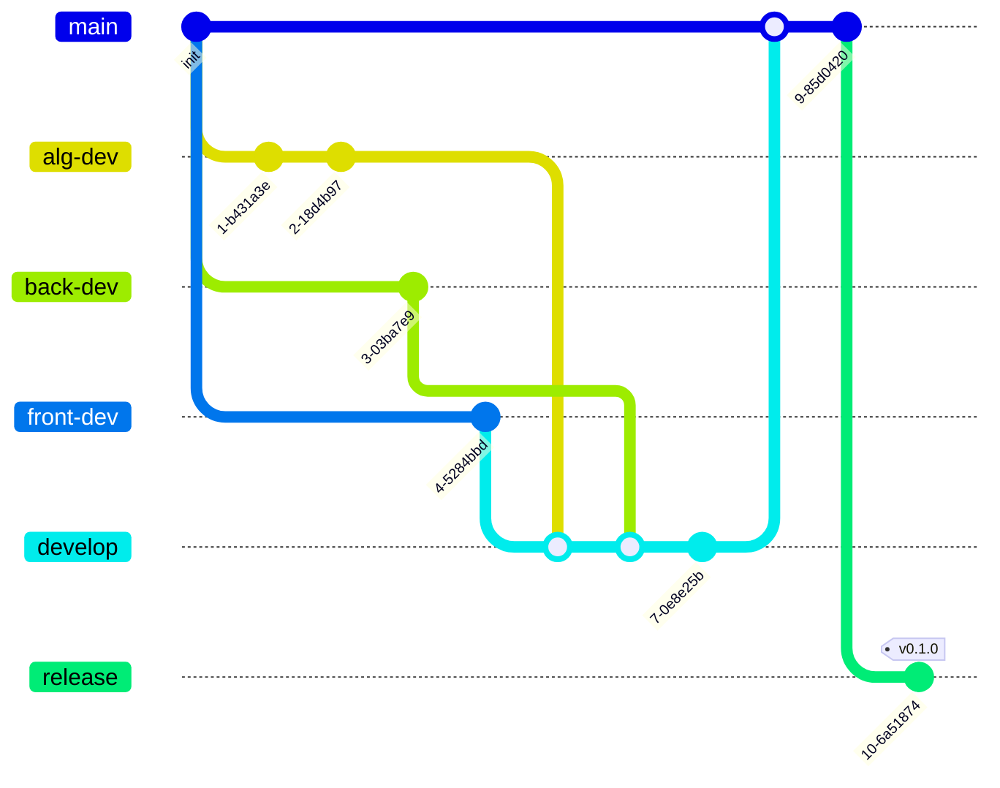

# 工程管理

## 版本管理模型
在这个项目中，我们有三条独立的开发分支，分别是`alg-dev`, `back-dev`, 以及`front-dev`, 在这三条分支上，我们会分别开发算法、后端、前端的功能，然后在`develop`分支上合并这三条分支，当代码积累到合适的程度时，我们会将`develop`分支合并到`main`分支，当代码在`main`分支上稳定运行一段时间后，我们会将`main`分支合并到`release`分支，这样就完成了一次版本的发布。

> 关于git版本管理，参考这篇[文章](https://nvie.com/posts/a-successful-git-branching-model/)